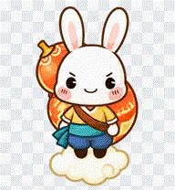

# 呱呱 Codex 桌宠合集 | Guagua Codex Pet Collection

基于《洛克王国》页游呱呱的四种非官方 Codex V2 桌宠形态。四种形态共享 8×11 动画布局，每种都提供独立的安装包和动画预览。

Four unofficial Codex V2 pet forms based on Guagua from the *Rock Kingdom* web game. Each form has its own installable package and animation previews, sharing the same 8×11 animation layout.

| 形态 / Form | 预览 / Preview | 安装文件 / Install files |
|---|---|---|
| [原版呱呱 #425 / Original](guagua-425/README.md) |  | [guagua-425](guagua-425/guagua-425) |
| [少林呱呱 #426 / Shaolin](guagua-426/README.md) |  | [guagua-426](guagua-426/guagua-426) |
| [富贵呱呱 #427 / Fugui](guagua-427/README.md) |  | [guagua-427](guagua-427/guagua-427) |
| [逍遥呱呱 #428 / Xiaoyao](guagua-428/README.md) |  | [guagua-428](guagua-428/guagua-428) |

## 安装 / Installation

进入所选形态的目录，把内层同名文件夹复制到 Codex 的 `pets` 目录。该文件夹应只包含 `pet.json` 和 `spritesheet.webp`。随后在 Codex Desktop 的 **Settings → Pets** 中选择对应桌宠。每种形态的详情和四个动画预览见各自的 README。

Choose a form, copy its inner package folder into the Codex `pets` directory, and select the pet in **Settings → Pets**. The package folder contains only `pet.json` and `spritesheet.webp`. See each form's README for details and four animation previews.

## 同人声明 / Fan-work notice

本项目为非官方、非商业同人作品。角色名称、形象与相关知识产权归其权利方所有。本仓库不代表获得权利方、OpenAI 或 Codex 授权；不对第三方角色形象授予开源再许可。

This is an unofficial, non-commercial fan work. The character and related intellectual property belong to their respective rights holders. No endorsement or authorization by the rights holders, OpenAI, or Codex is implied. This repository does not grant an open-source license to the underlying character IP.
